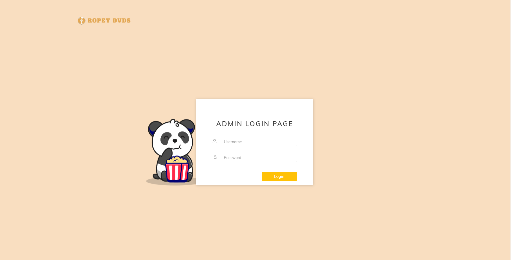
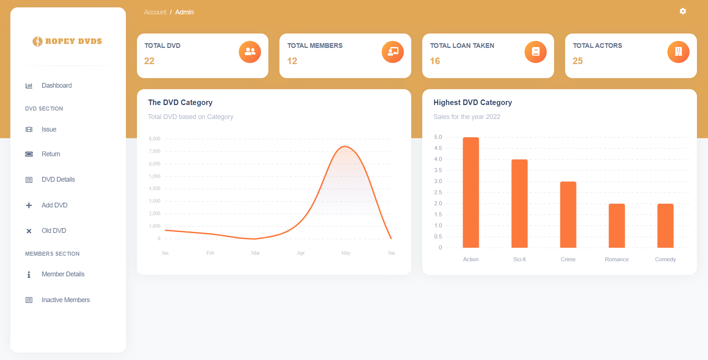

# Ropey DVD Management System

This project was assigned to us as a group coursework in whicch we were tasked to create a management system for Ropey DVDs to manage their stock, loaned and rented items. It is built using .net technology and c# as programming language. 

  

## Application Preview

    

 

    

 

    

 

## Index
- [About](#about)
-  [Application Preview](#preview)
- [Features](#features)
- [Requirements](#requirements)

  

## About
The primary goal of this system is to help Ropey DVDs manage their rented and returned DVDs. It also assists them in managing the details of various members of their store.

## Application Preview

    

 

    

 

    

 

    

 

    

 

  

  

## Features
Some of the features included in the system are:

- This web application has registration and login features for various users
- The system provides the ability to perform various features such as adding new DVDs items, listing out the producers, studio and caste list, keeping records of returned DVDs copies. 
- The system also allows you to keep an alphabetical list of members who do not have any DVDs on loan for a firm period.
- It also allows you to keep track of which members have DVDs on loan to a specific data set.

## Requirements

- 	The.NET Framework [Ideally V.6] must be installed on the system.
- 	Microsoft SQL Server Management Studio [Ideally 2018 version] must be installed.
-   Before running the application, perform `update-database` in the package console manager.

  

